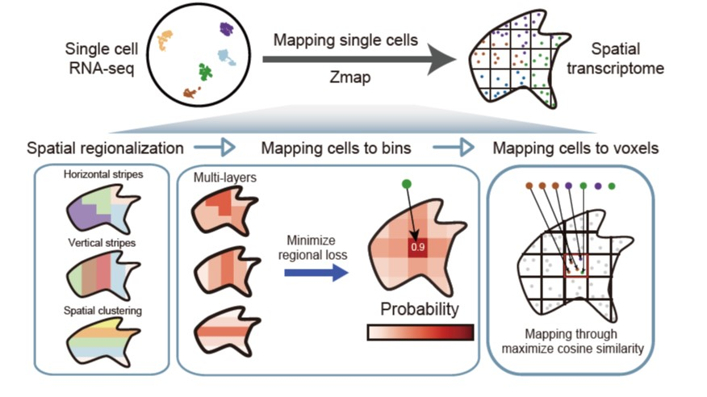

</a>
Mapping cell locations via multi-layer regionalization constraints
[](https://pypi.org/project/Polyomino-sc/)
[](https://polyomino.readthedocs.io/en/latest/)
=========================================================================

Introduction
------------
Resolving spatial cell arrangement is crucial for understanding physiological and pathological processes. While scRNA-seq captures gene expression at single-cell resolution, it loses spatial context, and current spatial transcriptomics methods often compromise on throughput or resolution. Existing integration methods face challenges with accuracy and scalability due to noise from molecular diffusion, cell segmentation errors, and disproportionate cell-type representation. We present Zmap, an algorithm framework employing multi-layered regional constraints to accurately assign cell locations, enhancing spatial accuracy and resilience to noise. Comparative analysis on benchmark datasets demonstrates Zmap’s superior accuracy and scalability over existing methods. Applied to liver cancer tissue, Zmap revealed spatial heterogeneity of cDC cells, a detail missed by deconvolution-based techniques, and achieved cell-cell interaction resolution beyond traditional mapping approaches. Additionally, Zmap outperforms current techniques in computational efficiency and resource usage, particularly with large-scale stereo-seq data, underscoring its potential for broad application.



Installation
------------
Zmap can be installed either through GitHub or PyPI.

To install from GitHub:

    git clone https://github.com/caiquanyou/Zmap
    cd Zmap
    python setup.py install # or pip install .

Alternatively, install via PyPI using:

    pip install zmap-sc

Usage
-----
After installation, Zmap can be used in Python as follows:
 ```python
    import Zmap as zm
    import scanpy as sc
    scdata = sc.read_h5ad('/Path/to/scdata.h5ad')
    stdata = sc.read_h5ad('/Path/to/stdata.h5ad')
    stdata_grid = zm.generate_grid(stdata,width=none)
    zm_object = zm.Zmap(scdata,stdata_grid,cluster_time=1,device='cpu')
    zm_object.allocate()
    cell_alocated_data = zm.sc2sc(scdata, stdata, zm_object.spot_matrix,thres=0.1,method='max')
 ```
Also can running in terminal:
 ```bash
zmap \
    -sc SC_path \
    -st ST_path \
    -w Width_of_grid \
    [-o OUTPUT] \
    [--cluster_time CLUSTER_TIME] \
    [--custom_region CUSTOM_REGION] \
    [--cluster_thres CLUSTER_THRES] \
    [--thres THRES] \
    [--method {max,lap}] \
    [--device {cpu,cuda}]
 ```

Contributing
------------
Contributions to Zmap are welcome. Please refer to the project's issues and pull requests for areas where you can help.

License
-------
**Free Software**

Support and Contact
-------------------
For support or to contact the developers, please use the project's GitHub Issues page.
